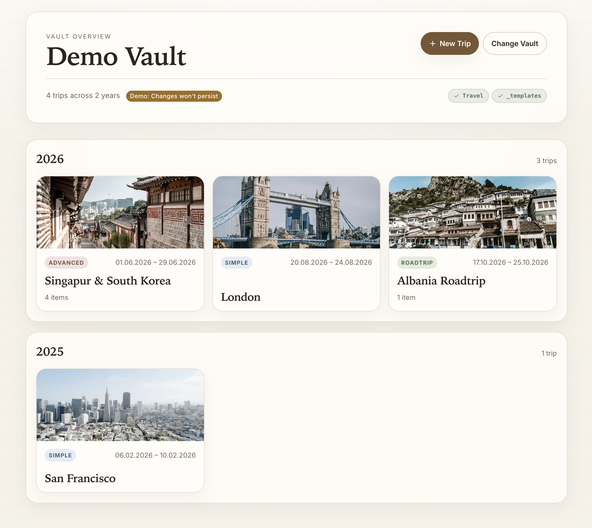

# RoamVault

A lightweight web app for creating travel notes in an [Obsidian](https://obsidian.md/) vault. Instead of manually creating files, applying templates, and filling out frontmatter properties inside Obsidian, RoamVault gives you a focused UI to do it in one click.

Your vault is the source of truth. RoamVault reads the folder structure and templates from disk and writes new Markdown files back. It does not edit existing files.

[**Website** (Open your vault or try a demo)](https://roamvault.netlify.app/)

> [!NOTE]
> This project is built for my personal Obsidian vault structure and travel workflow. It expects specific folder names, template files, and frontmatter conventions. If you find the idea useful, fork it and adjust the templates, folder paths, and property handling to match your own setup.



## How it works

RoamVault uses the [File System Access API](https://developer.mozilla.org/en-US/docs/Web/API/File_System_Access_API) to open an Obsidian vault folder directly from the browser. No server, no sync, no uploads. The vault handle is persisted in IndexedDB so it reopens automatically on your next visit.

The app expects two folders in the vault root:

- `_templates/` with Markdown template files that define frontmatter properties for each file type
- `Travel/` with year folders containing trip files and subfolders

## Trip types

RoamVault supports three kinds of trips, each with its own template:

- **Simple** (`Travel_Simple.md`): A single Markdown file for straightforward trips
- **Advanced** (`Travel_Advanced.md`): A folder with sub-items for day plans (`Planning/`) and activities (`Activities/`)
- **Roadtrip** (`Travel_Roadtrip.md`): A folder with stops (`Roadtrip/`)

When creating sub-items (activities, day plans, stops), the app fills in the `backlink` property, applies date constraints from the parent trip, and places the file in the correct subfolder.

## Template properties

Templates use YAML frontmatter. RoamVault handles the following automatically:

- `base` is kept as-is from the template
- `backlink` is set to a wikilink pointing to the parent trip file
- `"{{date}}"` placeholders are replaced with the selected date in `YYYY-MM-DD` format
- Empty string and array properties (`Persons`, `Location`, etc.) become form fields
- `banner` accepts an image URL
- `Done` renders as a checkbox

## Development

```bash
pnpm install
pnpm dev
```

### Scripts

| Command         | Description                    |
| --------------- | ------------------------------ |
| `pnpm dev`      | Start dev server               |
| `pnpm build`    | Production build               |
| `pnpm preview`  | Preview production build       |
| `pnpm check`    | Run svelte-check and tsc       |
| `pnpm lint`     | Run ESLint                     |
| `pnpm lint:fix` | Run ESLint with auto-fix       |
| `pnpm test`     | Run tests (Vitest)             |
| `pnpm coverage` | Run tests with coverage report |

## License

[MIT](./LICENSE)
